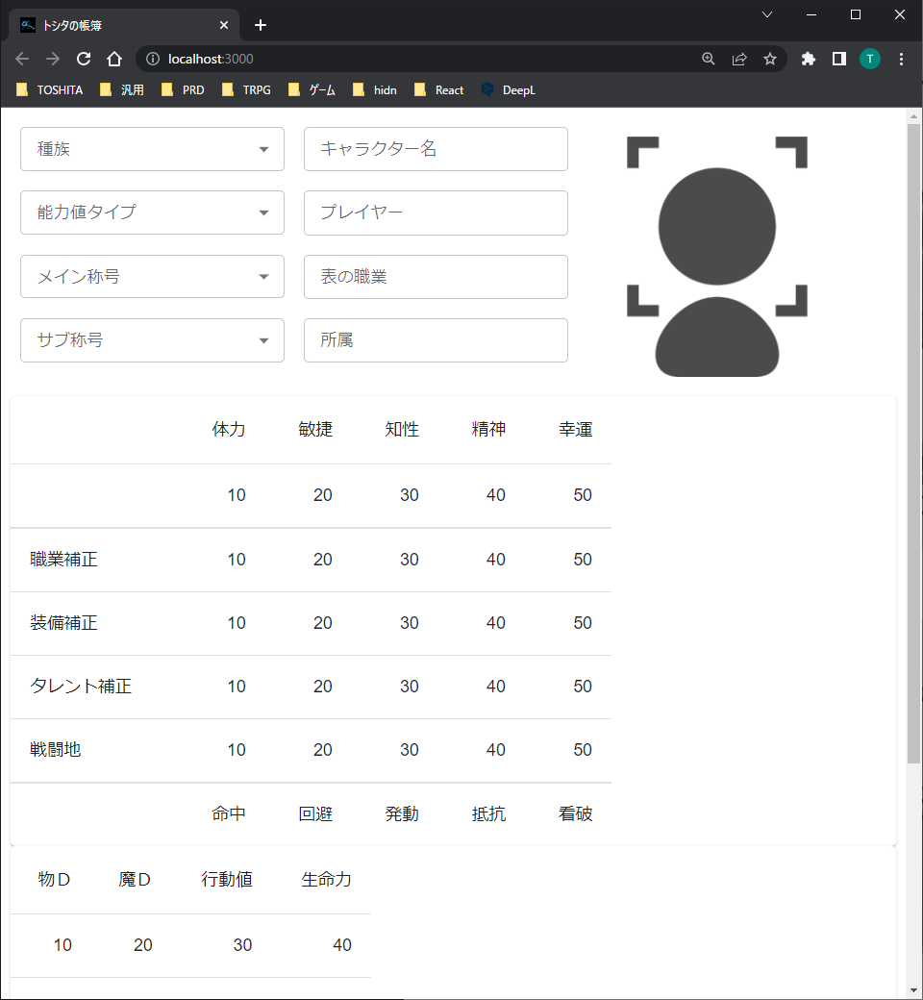

# 神薄 Kamisusuki
神我狩のキャラシ保管所を目指して☆

## 見た目

## 課題
- race から status-main に値を渡した後、表を更新する方法の実装

## データ構造
- 種族
  - 体力
  - 敏捷
  - 知性
  - 精神
  - 幸運
- 称号
  - 命中
  - 回避
  - 発動
  - 抵抗
  - 看破
  - 物Ｄ
  - 魔Ｄ
  - 行動値
  - 生命力
- 武器
  - 価格
  - 用法
  - カテゴリ
  - 距離
  - 対象
  - 抵抗
  - 命中/発動
  - ダメージ
  - 回避
  - 装甲
  - 結界
  - 行動値